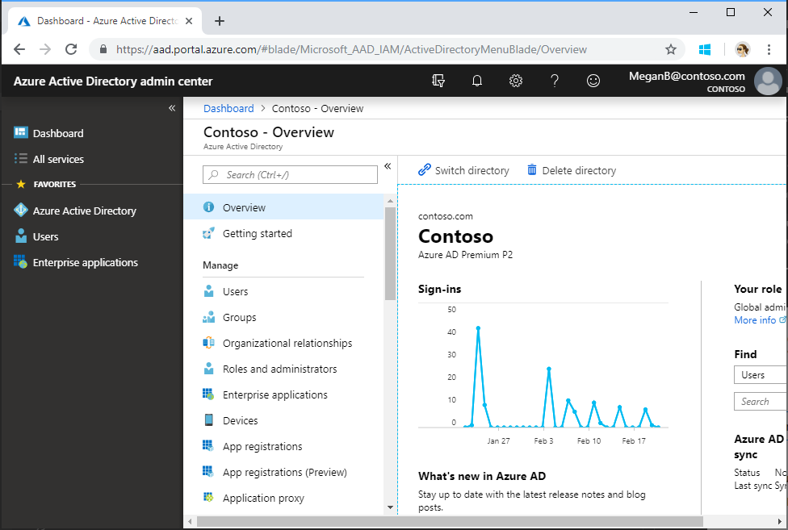

## Registering the app

1. Determine your ASP.NET app's URL. In Visual Studio's Solution Explorer, select the **MailboxSync** project. In the **Properties** window, find the value of **SSL URL**, `https://localhost:44300`. Copy this value.

    

1. Open a browser and navigate to the [Azure Active Directory admin center](https://aad.portal.azure.com). Login using a **Work or School Account**.

1. Select **Azure Active Directory** in the left-hand navigation, then select **App registrations (Preview)** under **Manage**.

    

1. Select **New registration**. On the **Register an application** page, set the values as follows.

    - Set a preferred **Name** e.g. `MailBox Sync Sample`.
    - Set **Supported account types** to **Accounts in any organizational directory**.
    - Under **Redirect URI**, set the first drop-down to `Web` and set the value to the ASP.NET app SSL URL you copied in step 1.

    

1. Choose **Register**. On the **MailBox Sync Sample** page, copy the value of the **Application (client) ID** and save it, you will need it in the next step.

    

1. Select **Authentication** under **Manage**. Locate the **Implicit grant** section and enable **ID tokens**. Choose **Save**.

    

1. Select **Certificates & secrets** under **Manage**. Select the **New client secret** button. Enter a value in **Description** and select one of the options for **Expires** and choose **Add**.

    

1. Copy the client secret value before you leave this page. You will need it in the next step.

    > [!IMPORTANT]
    > This client secret is never shown again, so make sure you copy it now.

    

1. From the **Manage** page, select **API permissions** > **Add a permission**.

You'll use the application ID and secret to configure the app in Visual Studio.
 
## Configure the app

1. Expose a public HTTPS notification endpoint. It can run on a service such as Microsoft Azure, or you can create a proxy web server by [using ngrok](#set-up-the-ngrok-proxy-optional) or a similar tool.

1. Open **MailboxSync.sln** in the sample files.

    > **Note:** You may be prompted to trust certificates for localhost.

1. In Solution Explorer, open the **web.config** file in the root directory of the project.
    - For the **ida:AppId** key, replace *ENTER_YOUR_APP_ID* with the application ID of your registered application.
    - For the **ida:AppSecret** key, replace *ENTER_YOUR_SECRET* with the secret of your registered application.
    - For the **ida:NotificationUrl** key, replace *ENTER_YOUR_NOTIFICATION_URL* with the HTTPS URL. Keep the */notification/listen* portion. If you're using ngrok, use the HTTPS URL that you copied. The value will look something like this:
    ```xml
    <add key="ida:NotificationUrl" value="https://0f6fd138.ngrok.io/notification/listen" />
    ```
    - For the **ida:PageSize** key, replace *15* with the value you want to paginate with


## Set up the ngrok proxy (optional)

You must expose a public HTTPS endpoint to create a subscription and receive notifications from Microsoft Graph. While testing, you can use ngrok to temporarily allow messages from Microsoft Graph to tunnel to a *localhost* port on your computer.

You can use the ngrok web interface ([http://127.0.0.1:4040](http://127.0.0.1:4040)) to inspect the HTTP traffic that passes through the tunnel. To learn more about using ngrok, see the [ngrok website](https://ngrok.com/).

1. In Solution Explorer, select the **GraphWebhooks** project.

1. Copy the **URL** port number from the **Properties** window. If the **Properties** window isn't showing, choose **View > Properties Window**.

    

1. [Download ngrok](https://ngrok.com/download) for Windows.

1. Unzip the package and run ngrok.exe.

1. Replace the two *{port-number}* placeholder values in the following command with the port number you copied, and then run the command in the ngrok console.

    ```Shell
    ngrok http {port-number} -host-header=localhost:{port-number}
    ```

    

1. Copy the HTTPS URL that's shown in the console. You'll use this to configure your notification URL in the sample.

    

    > **Note:** Keep the console open while testing. If you close it, the tunnel also closes and you'll need to generate a new URL and update the sample.

See [Hosting without a tunnel](https://github.com/microsoftgraph/nodejs-webhooks-rest-sample/wiki/Hosting-the-sample-without-a-tunnel) and [Why do I have to use a tunnel?](https://github.com/microsoftgraph/nodejs-webhooks-rest-sample/wiki/Why-do-I-have-to-use-a-tunnel) for more information.


## Build and run the app
1. Press F5 to build and run the solution in debug mode.
    > **Note:** If you get errors while installing packages, make sure the local path where you placed the solution is not too long/deep. Moving the solution closer to the root drive resolves this issue. 

## Key Components

### 1. MailService
A class that abstracts all the requests to the graph explorer so that the requests can be reusable everywhere in the solution.

### 2. DataService
A class that abstracts all the storage functions. The current implementation is to a json file which is not recommended for production.
You can use [DocumentDb](https://azure.microsoft.com/en-us/resources/videos/introduction-to-azure-documentdb) 

### 3. Local models
A local model that is separate from the models provided by the 
client library. It helps keep the code simple and you get to use only the
properties of the model that you need.

You can also add some properties to it to help out in your logic; while you can not add any properties to the client library models.

> **Note:** The Microsoft.Graph models should be looked at as convenient containers for the 
request and response bodies - that is, snapshots of the data at a point in time, 
and not to be used as client-side models.

Examples include:
- [`FolderItem.cs`](MailboxSync/Models/FolderItem.cs)
- [`MessageItem.cs`](MailboxSync/Models/MessageItem.cs)
